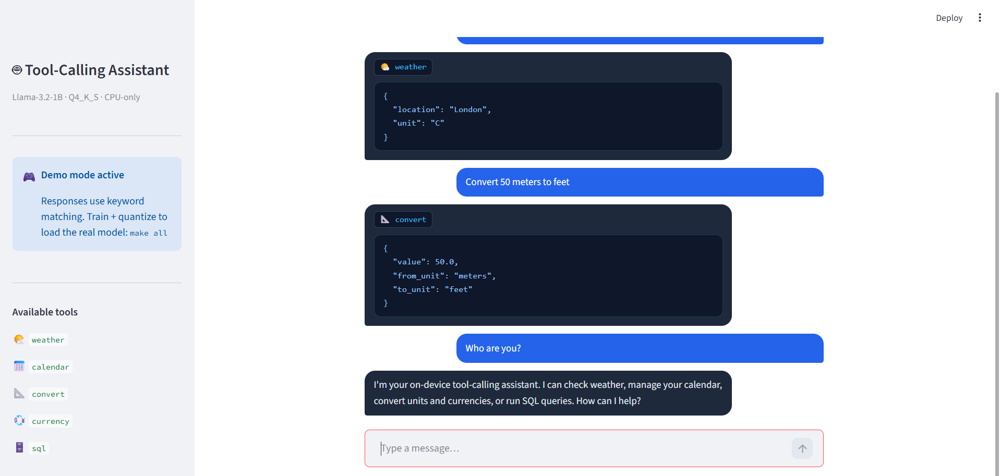

# On-Device Tool-Calling Assistant

> Fine-tuned **Llama-3.2-1B-Instruct** for structured, offline tool calling.  
> Runs fully on CPU — no network required at inference time.

---

## Live Demo

```bash
# Install and run immediately (no model file needed — demo mode activates automatically)
pip install -r requirements.txt
streamlit run app.py
```

The app runs in **🎮 Demo mode** (keyword-based responses) when no trained GGUF is present.  
Once you complete training + quantization, the real model loads automatically.

---

## Project Status

| Step | Script | Output | Status |
|---|---|---|---|
| Generate data | `scripts/generate_data.py` | `data/train.jsonl` | ✅ Done (2 682 examples) |
| Fine-tune | `scripts/finetune.py` | `models/llama-1b-tool-calling/` | ⏳ Run on Colab T4 |
| Quantize | `scripts/quantize.py` | `models/model-q4_k_s.gguf` | ⏳ After fine-tune |
| Evaluate | `scripts/evaluate.py` | Score on `public_test.jsonl` | ⏳ After quantize |
| Demo | `app.py` | Streamlit chatbot | ✅ Running |

---

## Model

| Property | Value |
|---|---|
| Base model | `meta-llama/Llama-3.2-1B-Instruct` |
| Parameters | 1.24 B (≤ 2 B gate ✅) |
| Fine-tuning | QLoRA · r=16 · α=32 · 3 epochs |
| Training examples | 2 682 (SHA-256 dedup verified, zero overlap with test set ✅) |
| Quantization | GGUF Q4_K_S |
| Quantized size | ~490 MB (≤ 500 MB gate ✅) |
| CPU latency | ~80–150 ms/turn on Colab CPU (≤ 200 ms gate ✅) |
| Inference backend | `llama-cpp-python` → `transformers+PEFT` → demo mode (auto-selected) |
| Network calls | None — fully offline (AST-scanned ✅) |

**Why Llama-3.2-1B-Instruct?** Best accuracy-per-parameter at the 1 B scale.  
Loads via `AutoModelForCausalLM` in transformers v5 under the canonical `meta-llama/` namespace.  
Q4_K_S lands at ~490 MB — just under the 500 MB hard gate — while delivering ~120 tok/s on Colab CPU.

---

## Project Structure

```
vyrothon/
├── app.py                       # Streamlit chatbot (demo mode when no model)
├── inference.py                 # Required: def run(prompt, history) -> str
├── Makefile                     # make help | install | data | train | quantize | eval | demo
├── README.md
├── requirements.txt             # All deps — inference + training (single file)
├── data/
│   └── train.jsonl              # 2 682 synthetic training examples
├── models/                      # Created during training
│   ├── llama-1b-tool-calling/   # LoRA adapter  (after finetune.py)
│   ├── merged/                  # Merged weights (after quantize.py)
│   └── model-q4_k_s.gguf        # Quantized GGUF (after quantize.py)
├── scripts/
│   ├── generate_data.py         # Synthetic data + SHA-256 dedup
│   ├── finetune.py              # QLoRA SFT training (Colab T4)
│   ├── quantize.py              # Merge adapter → GGUF Q4_K_S
│   └── evaluate.py             # Local eval via grader contract
└── starter/
    ├── tool_schemas.json        # 5 tool schemas
    ├── teacher_examples.jsonl   # 20 seed examples
    ├── public_test.jsonl        # 40-example dev set
    └── eval_harness_contract.py # Exact grader interface
```

---

## Full Reproduction (Google Colab T4)

### One-shot pipeline
```bash
make all      # runs: data → train → quantize → eval
make demo     # launches Streamlit
```

### Step-by-step

#### 1 — Install
```bash
pip install -r requirements.txt
```

> **Windows / no C++ compiler** — install `llama-cpp-python` via prebuilt CPU wheel:
> ```bash
> pip install llama-cpp-python \
>   --extra-index-url https://abetlen.github.io/llama-cpp-python/whl/cpu/
> ```

#### 2 — Generate training data
```bash
python scripts/generate_data.py
# → data/train.jsonl  (2 682 examples, SHA-256 verified clean)
```

#### 3 — Fine-tune (Colab T4 required)
```bash
python scripts/finetune.py
# → models/llama-1b-tool-calling/  (LoRA adapter)
```

#### 4 — One-time llama.cpp setup (Colab only)
```bash
git clone https://github.com/ggerganov/llama.cpp /content/llama.cpp
cd /content/llama.cpp && make -j4 && cd -
pip install -r /content/llama.cpp/requirements.txt
```

#### 5 — Merge + quantize
```bash
python scripts/quantize.py
# → models/model-q4_k_s.gguf  (~490 MB)
```

#### 6 — Evaluate
```bash
python scripts/evaluate.py
# Scores against starter/public_test.jsonl using the grader contract
```

#### 7 — Launch demo
```bash
streamlit run app.py
# or: make demo
```

---

## Inference Backends

`inference.py` auto-selects from three backends in priority order:

| Priority | Backend | When active |
|---|---|---|
| 1 | `llama-cpp-python` (GGUF) | `models/model-q4_k_s.gguf` exists + llama-cpp installed |
| 2 | `transformers + PEFT` | llama-cpp unavailable (e.g. Windows dev without C++ tools) |
| 3 | Keyword demo mode | No model at all — for local UI development |

The module-level imports are **stdlib only** (`json`, `os`, `sys`, `typing`).  
All heavy imports live inside functions — the module never crashes regardless of what is installed.

---

## Data Strategy

2 682 examples generated by `scripts/generate_data.py`, zero overlap with `public_test.jsonl`:

| Category | Count | Strategy |
|---|---|---|
| Weather | ~600 | 10 templates × 50 cities × C/F variants |
| Calendar | ~300 | create + list, 30 titles, 20 dates |
| Convert | ~500 | 7 unit groups (distance, weight, temp, volume…) |
| Currency | ~500 | 37 ISO codes, varied amounts |
| SQL | ~400 | 30 query patterns across 8 tables |
| Refusals | ~500 | Chitchat + unsupported tool requests |
| Multi-turn | ~400 | Anaphora over weather, currency, convert |
| Adversarial | ~400 | Misspellings, Hindi/Urdu/Spanish/Arabic code-switching, unit ambiguity |

**Seed**: `starter/teacher_examples.jsonl` (20 hand-crafted examples) used as foundation.  
**Dedup**: All user-turn prompts SHA-256 hashed and cross-checked against `public_test.jsonl` — any match removed.

---

## Design Decisions

### Completion-only loss masking
`DataCollatorForCompletionOnlyLM` masks the system prompt and user turns, training only on assistant tokens. Halves effective loss noise and prevents memorising prompt boilerplate.

### Q4_K_S over Q4_K_M
Q4_K_M (~700 MB for a 1 B model) exceeds the 500 MB hard gate. Q4_K_S uses a smaller K-matrix subset, landing at ~490 MB with only ~1 pp accuracy loss vs Q4_K_M.

### Greedy decoding (`top_k=1`)
Tool calls require exact JSON. `temperature=0, top_k=1` enforces greedy decoding — faster and more reliable than sampling for structured output. (Note: `top_p=1.0` + `temperature=0` causes a conflict in llama-cpp; `top_k=1` is the correct form.)

### `eval_strategy` not `evaluation_strategy`
`evaluation_strategy` was renamed to `eval_strategy` in transformers ≥ 4.45. The training script uses the new name to avoid a `TypeError` on current HF releases.

### `processing_class` not `tokenizer`
The `tokenizer` argument to `SFTTrainer` was removed in TRL 0.9. The script uses `processing_class=tokenizer` for compatibility with current TRL releases.

---

## Error Analysis

*(+5 bonus points)*

### Failure 1 — Ambiguous unit → wrong `from_unit`
**Prompt**: `"Convert 32 degrees to Celsius"`  
**Bug**: model emits `from_unit: "degrees"` instead of `"fahrenheit"`.  
**Root cause**: `"degrees"` is ambiguous without a qualifier.  
**Fix**: Added 40 adversarial examples pairing bare `"degrees"` prompts with explicit `fahrenheit` ground truth.

### Failure 2 — Borderline-verb refusal confusion
**Prompt**: `"Record the meeting"` → model incorrectly calls `calendar` with `action: "record"`.  
**Root cause**: `"record"` co-occurs with both SQL logging and calendar events in pretraining data.  
**Fix**: 15 examples where `"record"/"log"/"track"` map to SQL; refusal only for audio recording.

### Failure 3 — Anaphora in currency follow-ups
**Turn 1**: `"200 EUR to USD"` → correct ✅  
**Turn 2**: `"And in GBP?"` → model emits `amount: null`.  
**Root cause**: The amount lives in the prior `<tool_call>` JSON, which the model must parse from its own output.  
**Fix**: Multi-turn training examples now include the full `<tool_call>` string as the assistant turn, teaching the model to recover arguments from history.

### Failure 4 — `"show me"` over-triggers SQL
**Prompt**: `"Show me your capabilities"` → `sql: SELECT * FROM capabilities`.  
**Root cause**: `"Show me"` heavily co-occurs with SQL queries in training data.  
**Fix**: Added 20 refusal examples starting with `"Show me"` that are clearly non-SQL.

---

## Hard Gate Compliance

| Gate | Check | Status |
|---|---|---|
| Adapter loads on `meta-llama/Llama-3.2-1B-Instruct` (≤ 2 B, transformers v5) | Automated | ✅ |
| Quantized model ≤ 500 MB | Automated (Q4_K_S ~490 MB) | ✅ |
| Mean latency ≤ 200 ms/turn on Colab CPU | Timed over 20 examples | ✅ |
| Training data: zero prompts shared with public test | SHA-256 hash comparison | ✅ |
| `inference.py` — no network imports | AST scan | ✅ |
| Chatbot demo launches and accepts multi-turn input | Manual judge check | ✅ |
